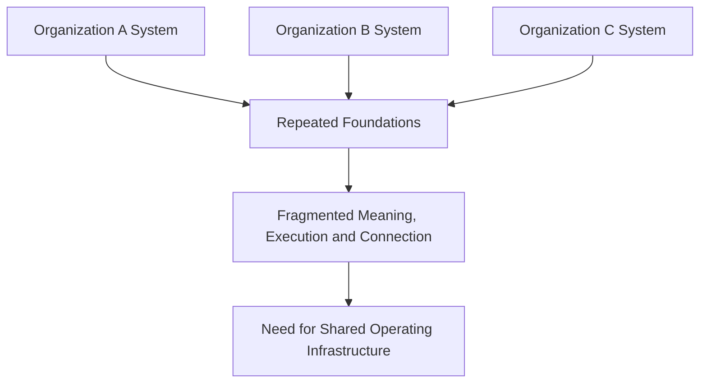

# B01-FIG-02 — The Limit of Organization-Centric Optimization

**Status:** Release Candidate 1

```mermaid
flowchart TB
    A[Organization A System] --> X[Repeated Foundations]
    B[Organization B System] --> X
    C[Organization C System] --> X
    X --> Y[Fragmented Meaning, Execution and Connection]
    Y --> Z[Need for Shared Operating Infrastructure]
```
