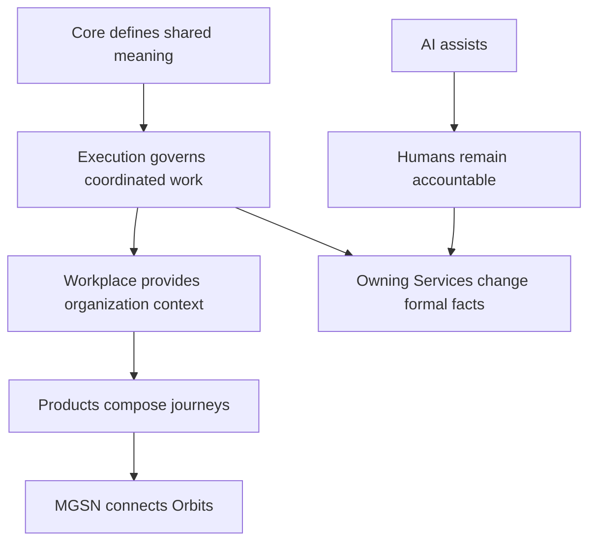

# B01-FIG-12 — Responsibility Lock

**Status:** Release Candidate 1

```mermaid
flowchart TB
    C[Core defines shared meaning]
    E[Execution governs coordinated work]
    W[Workplace provides organization context]
    P[Products compose journeys]
    N[MGSN connects Orbits]
    S[Owning Services change formal facts]
    H[Humans remain accountable]
    A[AI assists]
    C --> E --> W --> P
    P --> N
    E --> S
    H --> S
    A --> H
```
