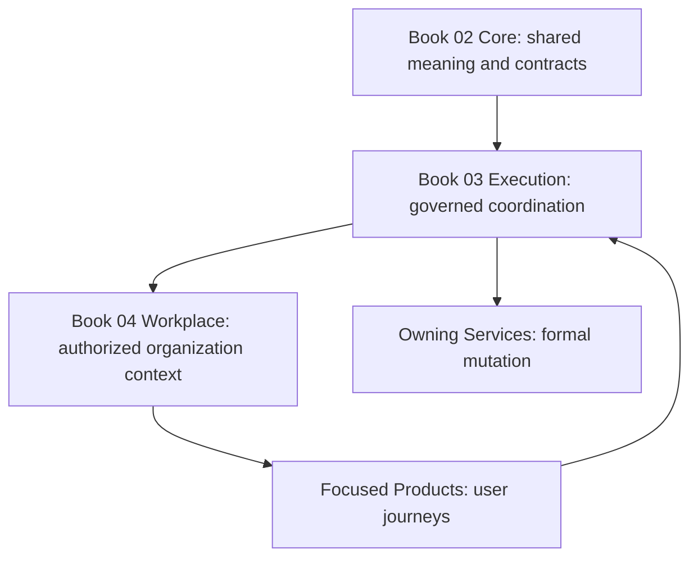

# B03-FIG-01 — Position Between Core and Product

**Status:** Release Candidate 1

```mermaid
flowchart TB
    C[Book 02 Core: shared meaning and contracts] --> E[Book 03 Execution: governed coordination]
    E --> W[Book 04 Workplace: authorized organization context]
    W --> P[Focused Products: user journeys]
    E --> S[Owning Services: formal mutation]
    P --> E
```
