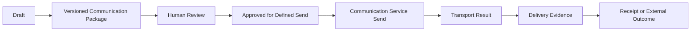

# B03-FIG-05 — Communication Boundary

**Status:** Release Candidate 1

```mermaid
flowchart LR
    D[Draft] --> V[Versioned Communication Package]
    V --> R[Human Review]
    R --> A[Approved for Defined Send]
    A --> S[Communication Service Send]
    S --> T[Transport Result]
    T --> L[Delivery Evidence]
    L --> X[Receipt or External Outcome]
```
