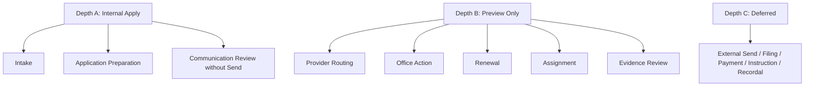

# B03-FIG-08 — MVP Workflow Depth

**Status:** Release Candidate 1

```mermaid
flowchart TB
    A[Depth A: Internal Apply] --> A1[Intake]
    A --> A2[Application Preparation]
    A --> A3[Communication Review without Send]
    B[Depth B: Preview Only] --> B1[Provider Routing]
    B --> B2[Office Action]
    B --> B3[Renewal]
    B --> B4[Assignment]
    B --> B5[Evidence Review]
    C[Depth C: Deferred] --> C1[External Send / Filing / Payment / Instruction / Recordal]
```
