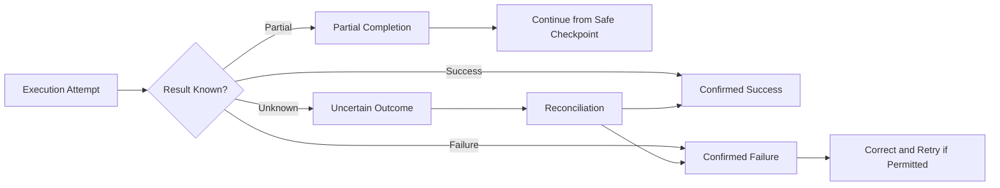

# B03-FIG-09 — Safe Failure, Retry and Reconciliation

**Status:** Release Candidate 1

```mermaid
flowchart LR
    E[Execution Attempt] --> R{Result Known?}
    R -->|Success| S[Confirmed Success]
    R -->|Failure| F[Confirmed Failure]
    R -->|Partial| P[Partial Completion]
    R -->|Unknown| U[Uncertain Outcome]
    F --> N[Correct and Retry if Permitted]
    P --> C[Continue from Safe Checkpoint]
    U --> Q[Reconciliation]
    Q --> S
    Q --> F
```
