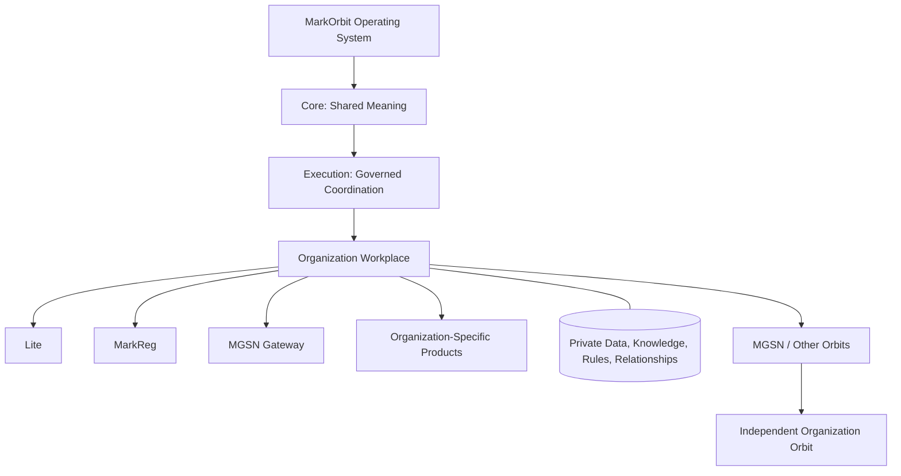

# B04-FIG-01 — Independent Organization Orbit Model

**Status:** Release Candidate 1  
**Book:** Book 04 — MarkOrbit Workplace and Product Architecture

## Interpretation

Each organization remains the real legal, commercial, and professional actor. Shared foundations support the Orbit; they do not own it.

## Authority Note

This figure is an explanatory architecture asset. It does not create a new Core Object, Service, status model, implementation topology, or protected-action authority.
