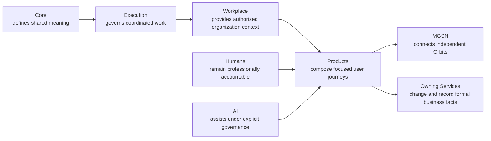

# B04-FIG-02 — Constitutional Responsibility Boundary

**Status:** Release Candidate 1  
**Book:** Book 04 — MarkOrbit Workplace and Product Architecture

## Interpretation

The diagram expresses responsibility, not mandatory deployment topology. Logical ownership must remain visible even when components are implemented together.

## Authority Note

This figure is an explanatory architecture asset. It does not create a new Core Object, Service, status model, implementation topology, or protected-action authority.
