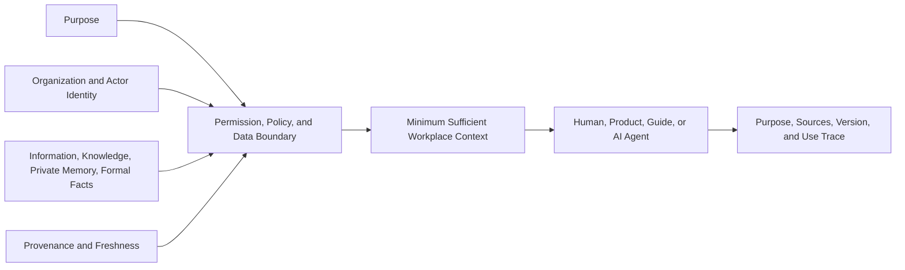

# B04-FIG-03 — Authorized Context Assembly

**Status:** Release Candidate 1  
**Book:** Book 04 — MarkOrbit Workplace and Product Architecture

## Interpretation

Authorized context is not the maximum available context. It is the minimum sufficient, purpose-bound, permission-filtered context required for the current work.

## Authority Note

This figure is an explanatory architecture asset. It does not create a new Core Object, Service, status model, implementation topology, or protected-action authority.
