# B04-FIG-04 — Prepared Action to Governed Execution

**Status:** Release Candidate 1  
**Book:** Book 04 — MarkOrbit Workplace and Product Architecture

```mermaid
flowchart LR
    Need[Need or Recommendation] --> Prepare[Prepare Versioned Action]
    Prepare --> Review[Human Review]
    Review --> Approval[Approval for Defined Consequence]
    Approval --> Revalidate[Current Identity, Permission, Policy, and State]
    Revalidate --> Execute[Execution Coordinates Governed Work]
    Execute --> Service[Owning Service Performs Mutation]
    Service --> Result[Typed Result and Event Trace]
    Result --> Workplace[Workplace Visibility and Follow-up]
```

## Interpretation

Prepared Action is the handoff representation; it is not execution. Approval is consequence-specific, and current authority must be re-evaluated before protected action.

## Authority Note

This figure is an explanatory architecture asset. It does not create a new Core Object, Service, status model, implementation topology, or protected-action authority.
