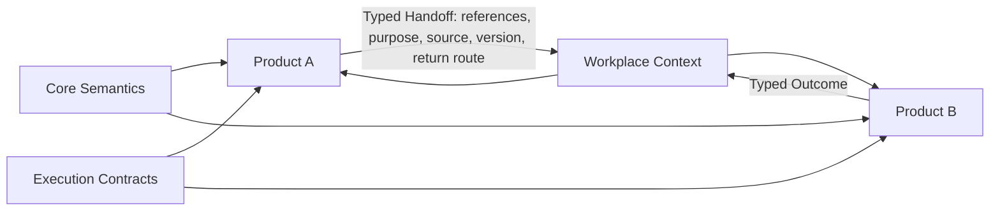

# B04-FIG-05 — Product Independence and Typed Handoff

**Status:** Release Candidate 1  
**Book:** Book 04 — MarkOrbit Workplace and Product Architecture

## Interpretation

Products retain focused journeys and Product-owned state. Continuity is preserved through references and typed Handoffs rather than a universal Product state machine.

## Authority Note

This figure is an explanatory architecture asset. It does not create a new Core Object, Service, status model, implementation topology, or protected-action authority.
