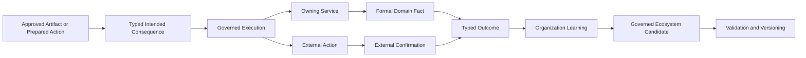

# B04-FIG-07 — Formalization and Outcome Feedback

**Status:** Release Candidate 1  
**Book:** Book 04 — MarkOrbit Workplace and Product Architecture

## Interpretation

Formalization, Delivery, Publish, and external outcome remain distinct. Feedback becomes shared Knowledge or Capability evidence only through governed candidate and validation paths.

## Authority Note

This figure is an explanatory architecture asset. It does not create a new Core Object, Service, status model, implementation topology, or protected-action authority.
