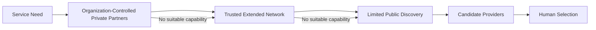

# B04-FIG-08 — Private-First Network Expansion

**Status:** Release Candidate 1  
**Book:** Book 04 — MarkOrbit Workplace and Product Architecture

## Interpretation

Discovery expands only as needed. Existing relationships, private pricing, client information, and organization-owned Trust are not surrendered to a central marketplace.

## Authority Note

This figure is an explanatory architecture asset. It does not create a new Core Object, Service, status model, implementation topology, or protected-action authority.
