# B04-FIG-09 — Capability Evidence, Routing, and Acceptance

**Status:** Release Candidate 1  
**Book:** Book 04 — MarkOrbit Workplace and Product Architecture

```mermaid
flowchart LR
    Claim[Capability Claim] --> Evidence
    Evidence --> Validation
    Validation --> Profile[Governed Profile]
    Profile --> Eligibility[Contextual Eligibility]
    Eligibility --> Compare[Candidate Comparison]
    Compare --> Recommend[Routing Recommendation]
    Recommend --> Select[Human Selection]
    Select --> Decision[Routing Decision]
    Decision --> Prepare[Appointment Preparation]
    Prepare --> Approve[Approval Where Required]
    Approve --> Instruct[Governed Provider Instruction]
    Instruct --> Accept[Provider Acceptance]
```

## Interpretation

Ranking does not appoint a provider. Human selection, appointment, instruction, and provider acceptance are separate governed events.

## Authority Note

This figure is an explanatory architecture asset. It does not create a new Core Object, Service, status model, implementation topology, or protected-action authority.
