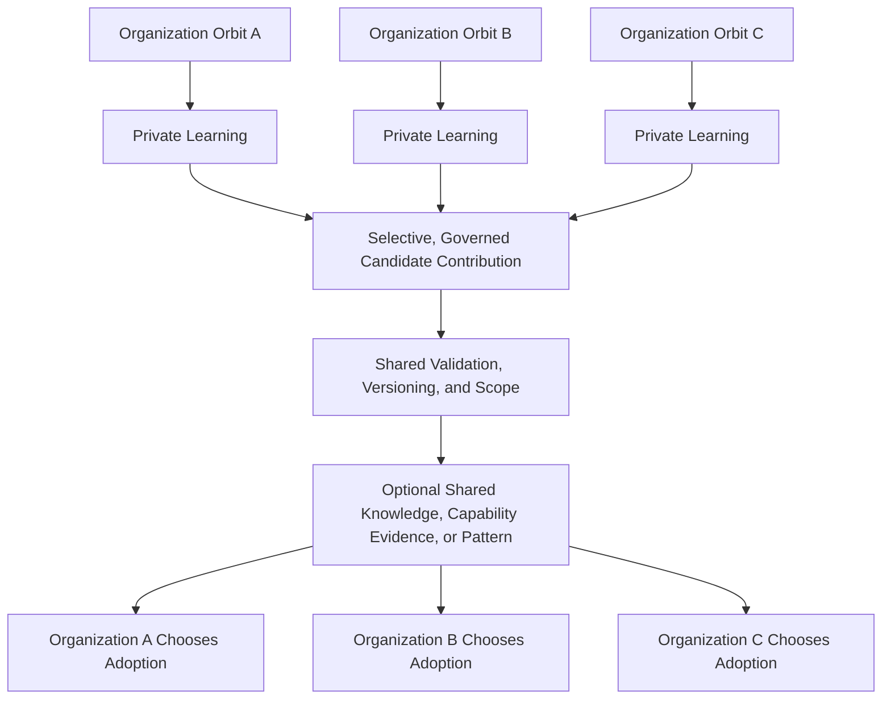

# B04-FIG-10 — Decentralized Ecosystem Learning

**Status:** Release Candidate 1  
**Book:** Book 04 — MarkOrbit Workplace and Product Architecture

## Interpretation

Ecosystem learning does not require centralized ownership or forced convergence. Organizations learn privately, contribute selectively, and adopt governed results voluntarily.

## Authority Note

This figure is an explanatory architecture asset. It does not create a new Core Object, Service, status model, implementation topology, or protected-action authority.
