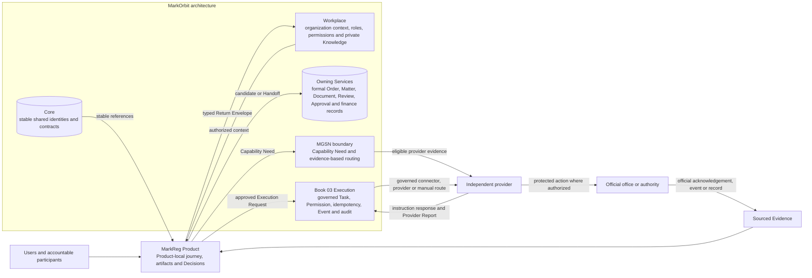

# B05-FIG-01 — MarkReg Position in the MarkOrbit Architecture

## Control

- **Status:** Controlled Figure Source v1.0 — PF-07
- **Disposition:** retained
- **Format:** Mermaid flowchart
- **Primary sources:** CH04, CH43, CH47 and B05-PUB-0007
- **Intended placement:** CH04; reusable in CH43 and CH47

## Caption

**Figure 1. MarkReg is a focused Product inside the wider MarkOrbit architecture.** It consumes authorized Workplace context and stable Core references, prepares Product-local artifacts and Decisions, hands formal candidates to Owning Services, requests governed work from Execution and consumes provider or official evidence. It does not absorb the authority of the surrounding systems.

## Controlled Source

## Accessibility Description

The diagram places MarkReg in the center. Users act through MarkReg. Workplace and Core provide authorized organization context and stable shared references. MarkReg sends formal candidates to Owning Services, sends approved requests to Book 03 Execution and expresses provider Capability Needs toward the MGSN boundary. Execution or an appointed provider interacts with an official office. Official evidence returns to MarkReg, and MarkReg returns typed results to the Workplace. Each surrounding component retains its own authority.

## Grayscale and Legibility Notes

- Contexts are separated by labelled subgraphs and node titles, not color.
- The official office and evidence-return path remain on the right to preserve reading order.
- The diagram should be rendered in landscape orientation.
- Minimum body text should remain readable at a single-page width.

## Simplifications and Boundary

The figure omits individual Core object types, provider-selection stages and formal Workflow details. It does not imply that every MarkReg journey uses MGSN, a connector or an external provider. MarkReg does not become the Workplace, Core, Execution engine, provider network, Owning Service or official authority.