# B05-FIG-02 — Full-Lifecycle Product Journey

## Control

- **Status:** Controlled Figure Source v1.0 — PF-07
- **Disposition:** retained
- **Format:** Mermaid flowchart
- **Primary sources:** CH07–CH47, B05-SPEC-0001 v0.3 and Appendix A
- **Intended placement:** CH07 and Appendix A

## Caption

**Figure 2. MarkReg connects a trademark need to continuing lifecycle work through a sequence of bounded Product stages.** The sequence is a Product journey and lineage map, not one universal Workflow. A matter may stop, branch, resume or enter at a later stage when controlled prior records are supplied.

## Controlled Source

```mermaid
flowchart TB
    subgraph P2["Need, strategy and recommendation"]
        N["Business Context Snapshot and Need Brief"] --> R["Recommendation Set"]
        R --> O["Option Set"]
        O --> S["filing units, applicant context, scope and risk"]
    end

    subgraph P3["Commercial journey and Formal Intake"]
        S --> PR["Proposal"]
        PR --> Q["Quote"]
        Q --> CA{"Client Acceptance"}
        CA --> CI["Commercial Instruction"]
        CI --> FI["Formal Intake and Requirement Set"]
        FI --> RA["Readiness Assessment"]
        RA --> HE["Handoff Envelope"]
    end

    subgraph P4["Preparation and governed action"]
        HE --> FP["Filing Package Candidate"]
        FP --> PD{"Professional Decision"}
        PD --> FA{"Filing Approval"}
        FA --> RT["routing, appointment and Provider Acceptance"]
        RT --> EX["governed Execution"]
        EX --> SE["submission and delivery Evidence"]
        SE --> OA["Official Acknowledgement Evidence"]
        SE -. "unknown or conflict" .-> RC["Reconciliation and recovery"]
        RC -.-> EX
    end

    subgraph P5["Official events, examination and disputes"]
        OA --> OE["Official Event Snapshot"]
        OE --> ER["examination response path"]
        OE --> PU["publication or challenge path"]
        ER --> OUT["sourced Outcome Snapshot"]
        PU --> OUT
    end

    subgraph P6["Registration and portfolio continuity"]
        OUT --> REG["Registration Outcome Record where applicable"]
        REG --> RB["Right Baseline"]
        RB --> MO["Maintenance Obligation Set"]
        MO --> RN["renewal, recordal or transaction work"]
        RN --> PV["Portfolio Continuity View and Action Plan"]
    end

    subgraph P7["Experience, governance and evolution"]
        PV --> PS["Product Session and typed Return"]
        PS --> JP["Jurisdiction Pack and AI governance"]
        JP --> EV["metrics, Evaluation and Pilot Context"]
        EV --> CF["Conformance Statement"]
    end

    R -. "recommendation is not Decision" .-> CA
    RA -. "readiness is not Approval" .-> FA
    FA -. "approval is not Execution" .-> EX
    SE -. "submission is not official acknowledgement" .-> OA
    CF -. "publication or conformance is not production authority" .-> EV
```

## Accessibility Description

The diagram is arranged vertically in six stages. It begins with a business need and recommendations, continues through Proposal, Quote, acceptance, Intake and Handoff, then moves to Package preparation, Human Decisions, provider routing, governed Execution and acknowledgement. Official events may branch into examination or publication and dispute paths. A verified registration can establish a Right Baseline and lead to maintenance, renewal, recordal, transaction and portfolio work. The final stage covers Product Session, jurisdiction governance, evaluation and Conformance. Dotted annotations preserve the major constitutional distinctions.

## Grayscale and Legibility Notes

- Each lifecycle part is separated by a titled subgraph.
- Decision gates use diamonds and are labelled with the accountable Decision.
- Dotted arrows indicate constitutional distinctions or recovery, not normal progression.
- For print, render as a full-page portrait figure or two facing-page panels without changing node order.

## Simplifications and Boundary

The figure omits many service-specific branches and does not imply that every journey reaches registration or portfolio work. It does not merge independent jurisdictions, applications, proceedings or rights. Formal Order, Matter, payment and Book 03 Execution records remain owned outside the Product-local journey.