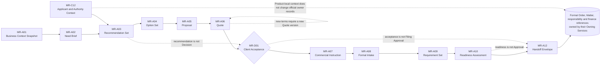

# B05-FIG-03 — Need-to-Handoff Artifact and Decision Lineage

## Control

- **Status:** Controlled Figure Source v1.0 — PF-07
- **Disposition:** retained and expanded; absorbs planned B05-FIG-05
- **Format:** Mermaid flowchart
- **Primary sources:** CH08–CH22, B05-SPEC-0001 v0.3 and Appendix A
- **Intended placement:** CH16 or CH22; reusable in Appendix A

## Caption

**Figure 3. The pre-filing journey converts a business need into a governed Handoff through versioned artifacts and accountable Decisions.** Recommendations, options and pricing remain candidates until the relevant Human actor accepts or decides. Client Acceptance and Commercial Instruction do not create Filing Approval or official effect.

## Controlled Source

## Accessibility Description

The figure reads left to right. A Business Context Snapshot becomes a Need Brief, Recommendation Set and Option Set. Applicant and authority context informs the recommendations. The selected commercial configuration becomes a Proposal and immutable Quote. An authorized client accepts an exact Quote version, after which Commercial Instruction, Formal Intake, a Requirement Set and a purpose-specific Readiness Assessment are prepared. A Handoff Envelope then transfers stable references to the formal services that own Order, Matter, responsibility and finance records. Dotted annotations show that recommendation, acceptance and readiness do not equal later approval or official effect.

## Grayscale and Legibility Notes

- Product artifacts use rectangular nodes; the accountable client Decision uses a diamond; formal records use a database-shaped node.
- The diagram should render in landscape orientation.
- Record IDs are included so the figure remains useful without color.
- Dotted annotations may be placed below the main lineage in narrow formats.

## Simplifications and Boundary

B05-FIG-05 was merged into this figure because a separate Recommendation-to-Commercial-Instruction diagram duplicated the first half of the same lineage. This figure does not show every class, goods/services, search, risk, payment or document dependency. A Handoff does not silently create formal objects, and none of these stages constitutes Filing Approval, Execution or an official filing.