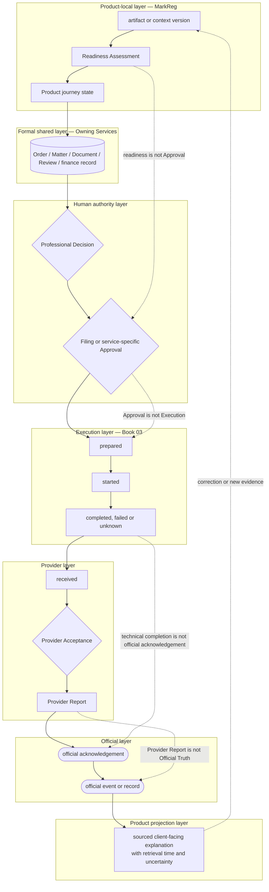

# B05-FIG-04 — State and Authority Layers

## Control

- **Status:** Controlled Figure Source v1.0 — PF-07
- **Disposition:** retained
- **Format:** Mermaid flowchart
- **Primary sources:** CH07, CH21–CH30, B05-SPEC-0001 v0.3 and Appendix B
- **Intended placement:** CH07 and Appendix B

## Caption

**Figure 4. One trademark journey contains several independent state and authority layers.** A Product surface may summarize them, but no single status may replace Product, formal, Approval, Execution, provider, official and client-projection states.

## Controlled Source

## Accessibility Description

The diagram contains seven stacked lanes. The top lane holds Product-local artifacts, readiness and journey state. Below it are formal shared records, Human Decisions and approvals, Book 03 Execution state, provider receipt and reporting, official acknowledgement and official events, and finally a sourced client-facing projection. Arrows show how information and authority move downward. Dotted annotations state that readiness is not approval, approval is not Execution, technical completion is not official acknowledgement and Provider Report is not Official Truth. A correction path returns new evidence to the Product-local layer.

## Grayscale and Legibility Notes

- Each layer has an explicit title and retains a separate horizontal lane.
- Human Decisions use diamonds; formal records use a database shape; official states use terminal shapes.
- The figure should render in portrait orientation at full-page width.
- If split across pages, the layer titles and constitutional annotations must be repeated.

## Simplifications and Boundary

The figure shows one representative direction of state propagation. It does not imply that every provider route uses the same systems or that official events arrive in a single sequence. Client-facing projection remains an interpretation with source and freshness, not an official record.