# B05-FIG-06 — Filing Package to Official Acknowledgement

## Control

- **Status:** Controlled Figure Source v1.0 — PF-07
- **Disposition:** retained
- **Format:** Mermaid flowchart
- **Primary sources:** CH23–CH29, B05-SPEC-0001 v0.3 and Appendix B
- **Intended placement:** CH28 or CH29

## Caption

**Figure 6. A filing package becomes an officially acknowledged action only through separate Review, approval, routing, provider, Execution and evidence states.** Unknown external effect opens reconciliation; it does not justify a blind retry.

## Controlled Source

```mermaid
flowchart LR
    A11["MR-A11\nFiling Package Candidate"] --> D02{"MR-D02\nProfessional Decision"}
    D02 --> D03{"MR-D03\nFiling Approval"}

    D03 --> C01["MR-C01\nCapability Need"]
    C01 --> A14["MR-A14\nRouting Recommendation"]
    A14 --> D04{"MR-D04\nHuman Selection"}
    D04 --> A15["MR-A15\nProvider Appointment"]
    A15 --> A16["MR-A16\nProvider Instruction"]
    A16 --> D05{"MR-D05\nProvider Acceptance"}

    D05 --> A17["MR-A17\nExecution Request"]
    A17 --> E01["MR-E01\nSubmission Evidence"]
    E01 --> E02["MR-E02\nDelivery Evidence"]
    E02 --> E03["MR-E03\nProvider Report"]
    E03 --> E04(["MR-E04\nOfficial Acknowledgement Evidence"])

    E01 -. "timeout, conflict or unknown effect" .-> C02["MR-C02\nReconciliation Context"]
    E02 -. "delivery without acceptance or official receipt" .-> C02
    C02 --> A18["MR-A18\nRecovery Plan"]
    A18 -. "retry only after safe disposition" .-> A17

    D03 -. "Approval is not Execution" .-> A17
    D04 -. "Selection is not appointment or acceptance" .-> D05
    E03 -. "Provider Report is not Official Truth" .-> E04
```

## Accessibility Description

The left-to-right sequence begins with a Filing Package Candidate. An eligible professional records a Professional Decision, and an authorized approver grants Filing Approval for the exact package version. The Product then identifies a Capability Need, prepares a Routing Recommendation and records Human Selection, appointment, instruction and Provider Acceptance. Book 03 Execution produces submission and delivery evidence. A provider may report filing, but only official acknowledgement evidence supports the officially received state. Timeouts, conflicts or unknown effects open Reconciliation Context and a Recovery Plan before any retry.

## Grayscale and Legibility Notes

- Candidate and evidence records use labelled rectangles; Human and provider Decisions use diamonds; official acknowledgement uses a terminal shape.
- The main path is a single landscape line; recovery is shown beneath it with dotted arrows.
- Record IDs remain visible in grayscale and small-size rendering.
- A narrow layout may wrap after Provider Acceptance but must retain the state order.

## Simplifications and Boundary

The figure does not show payment, formal Matter ownership, every connector state or jurisdiction-specific submission route. It does not imply that a provider is required for every filing. Submission Evidence, Delivery Evidence and Provider Report remain different from Official Acknowledgement Evidence and later official outcomes.