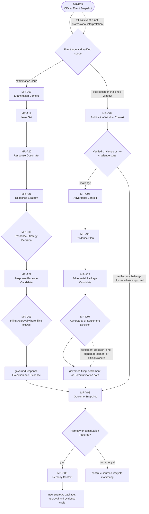

# B05-FIG-07 — Examination, Dispute and Remedy Paths

## Control

- **Status:** Controlled Figure Source v1.0 — PF-07
- **Disposition:** retained
- **Format:** Mermaid flowchart
- **Primary sources:** CH30–CH36, B05-SPEC-0001 v0.3 and Appendix A
- **Intended placement:** CH30 or CH36

## Caption

**Figure 7. Official events can lead to examination, publication, adversarial or remedy paths that remain separately sourced and approved.** The figure shows Product records and Decisions around those paths; it does not predict or guarantee an official outcome.

## Controlled Source

## Accessibility Description

An Official Event Snapshot enters a decision point that identifies the verified event type and affected scope. An examination issue creates an Examination Context, Issue Set, Response Options, Response Strategy, Human Decision, Response Package and, where needed, Filing Approval and governed response filing. A publication event creates a Publication Window Context. A verified challenge creates an Adversarial Context, Evidence Plan, adversarial package and authorized dispute or settlement Decision. Each path produces a sourced Outcome Snapshot. A further branch determines whether a Remedy Context or continued lifecycle monitoring is required.

## Grayscale and Legibility Notes

- Examination and publication/dispute paths occupy separate branches with labelled event types.
- Decisions and branch points use diamonds; sourced official events use terminal shapes.
- The figure should render as a full-page portrait diagram.
- Path labels must remain visible when printed without color.

## Simplifications and Boundary

The figure does not enumerate every examination ground, opposition stage, appeal, review, cancellation, invalidation, restoration or settlement form. No path is automatic. A Product Outcome Snapshot remains sourced interpretation and does not create official closure, registration or remedy success.