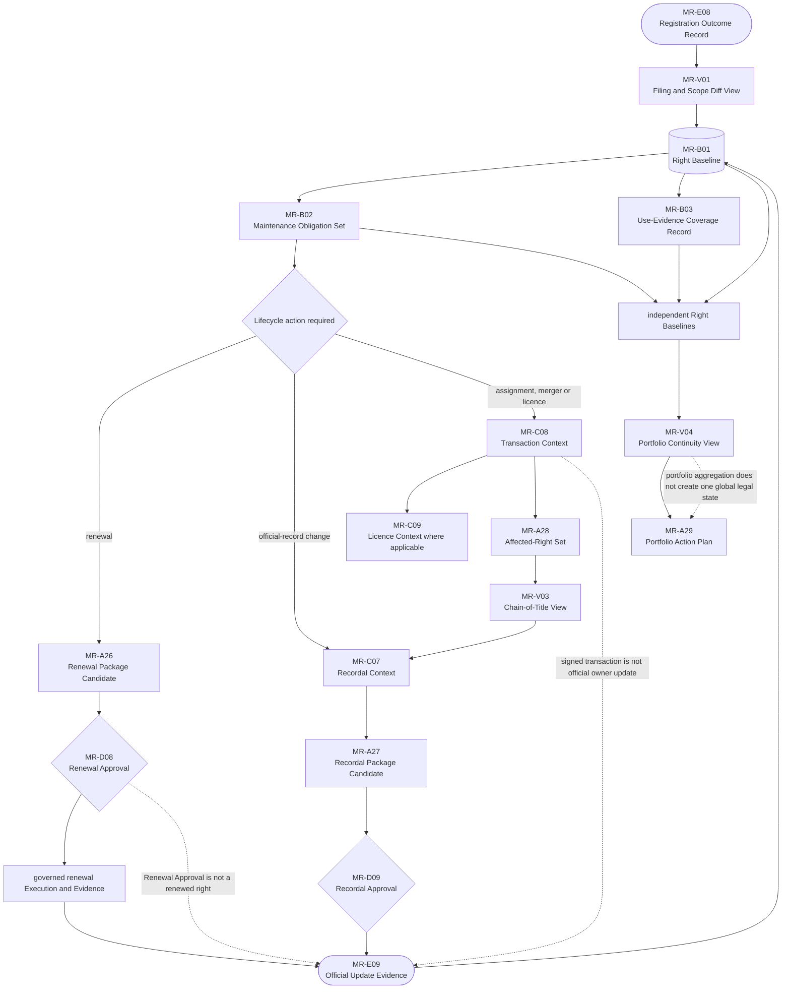

# B05-FIG-08 — Registration and Portfolio Continuity

## Control

- **Status:** Controlled Figure Source v1.0 — PF-07
- **Disposition:** retained
- **Format:** Mermaid flowchart
- **Primary sources:** CH37–CH42, B05-SPEC-0001 v0.3 and Appendix A
- **Intended placement:** CH37 or CH42

## Caption

**Figure 8. Registration begins a continuing rights-management cycle rather than ending the Product journey.** Each right retains its own official record, obligations, renewal, ownership and dispute state before being projected into a portfolio view.

## Controlled Source

## Accessibility Description

A verified Registration Outcome Record is compared with the filing scope and used to establish a Right Baseline. The baseline supports a Maintenance Obligation Set and a Use-Evidence Coverage Record. When action is required, the journey may branch into renewal, official recordal or a transaction such as assignment, merger or licensing. Each action has its own candidate package, Human approval, governed Execution and Official Update Evidence before the baseline changes. Independent baselines and obligations may then be summarized in a Portfolio Continuity View and prioritized through a Portfolio Action Plan.

## Grayscale and Legibility Notes

- The Right Baseline is shown as a stable record node and remains visually central.
- Renewal, recordal and transaction paths use distinct labelled branches.
- Human approvals use diamonds; official update evidence uses a terminal shape.
- For print, render in portrait orientation with the portfolio aggregation at the bottom.

## Simplifications and Boundary

The figure does not imply that every registered right has the same maintenance, use, renewal or recordal duties. It does not merge independent rights or jurisdictions. Contractual effect, official recordal and current official ownership remain separate states.