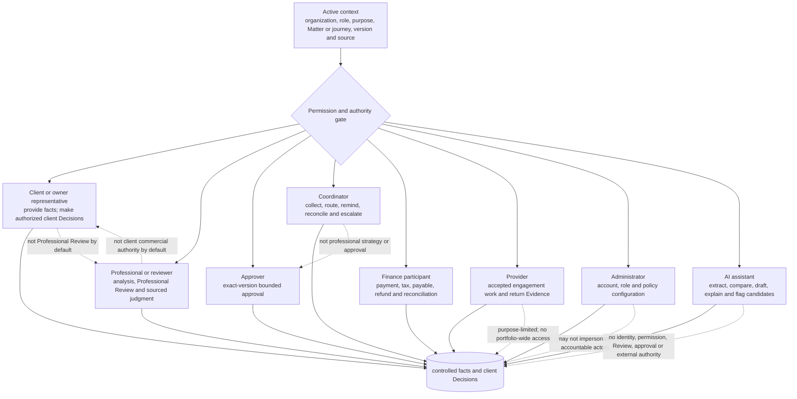

# B05-FIG-09 — Participant Visibility and Action Rights

## Control

- **Status:** Controlled Figure Source v1.0 — PF-07
- **Disposition:** retained
- **Format:** Mermaid flowchart
- **Primary sources:** CH05, CH44, B05-SPEC-0003 v0.3 and Appendix C
- **Intended placement:** CH44 and Appendix C

## Caption

**Figure 9. Participant visibility and action rights are purpose-, role-, organization- and relationship-specific.** Access to a surface does not grant professional qualification, approval authority, provider appointment or permission for an External Protected Action.

## Controlled Source

## Accessibility Description

The figure begins with an active context containing organization, role, purpose, journey or Matter, version and source. A permission and authority gate controls eight participant paths: client or owner representative, professional or reviewer, approver, coordinator, finance participant, provider, administrator and AI assistant. Each path lists the participant’s permitted contribution and returns to controlled records. Dotted annotations identify prohibited assumptions, including coordinator approval, administrator impersonation, AI authority and provider access beyond the accepted engagement.

## Grayscale and Legibility Notes

- Every participant node includes both role and permitted contribution.
- Prohibited assumptions are written on dotted arrows rather than encoded by color.
- The diagram should render in landscape orientation or as two stacked rows of participant nodes.
- The active context and permission gate must remain visible in every layout variation.

## Simplifications and Boundary

The figure is not a complete permission matrix and does not replace organization policy, professional qualification, delegation, accepted engagement or jurisdiction rules. One person may hold several roles, but each material action must record the active role and authority basis.