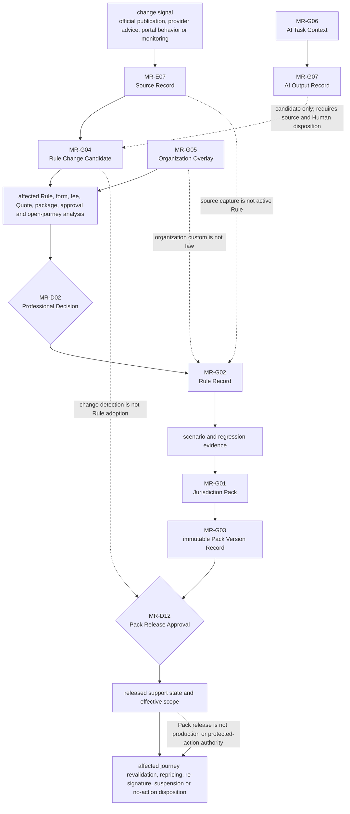

# B05-FIG-10 — Jurisdiction Pack and Rule Change Workflow

## Control

- **Status:** Controlled Figure Source v1.0 — PF-07
- **Disposition:** retained
- **Format:** Mermaid flowchart
- **Primary sources:** CH45, B05-SPEC-0004 v0.3 and Appendix F
- **Intended placement:** CH45 and Appendix F

## Caption

**Figure 10. A detected legal, fee, form or practice change does not become an active Product rule automatically.** The change must be sourced, analyzed, professionally reviewed, tested and released as a new Pack version before protected Product behavior may depend on it.

## Controlled Source

## Accessibility Description

A change signal is captured as a Source Record and classified as a Rule Change Candidate. The Product analyzes affected rules, forms, fees, Quotes, packages, approvals and open journeys. An eligible professional makes a Decision, after which the Rule Record is updated and tested. The Rule enters a Jurisdiction Pack and immutable Pack Version, and an authorized professional owner grants Pack Release Approval. The released version then triggers journey revalidation, repricing, re-signature, suspension or a no-action decision. An Organization Overlay may inform impact analysis but cannot replace law. AI may produce a candidate only when tied to sources and Human disposition.

## Grayscale and Legibility Notes

- The primary workflow is vertical and numbered by controlled record IDs.
- Human Decisions use diamonds; candidate and released records use labelled rectangles.
- Overlay and AI inputs enter from the side with explicit boundary labels.
- The figure should render in portrait orientation and remain readable as a checklist-like process.

## Simplifications and Boundary

The figure does not define jurisdiction law or a universal source hierarchy for every legal question. Pack release may still leave a service Research Only, Suspended or otherwise limited. Neither a released Pack nor a passing scenario grants production deployment, provider appointment, Filing Approval or External Protected Action authority.