# B05-FIG-11 — MarkReg MVP Delivery Sequence

## Control

- **Status:** Controlled Figure Source v1.0 — PF-07
- **Disposition:** retained
- **Format:** Mermaid flowchart
- **Primary sources:** CH46 and Appendix G
- **Intended placement:** CH46

## Caption

**Figure 11. MarkReg may deliver a narrow end-to-end vertical slice before supporting the full lifecycle.** Each MVP increment adds governed capability and evidence; it does not inherit production or External Protected Action authority merely because the prior increment passed.

## Controlled Source

```mermaid
flowchart LR
    M0["MVP 0\nGuided Decision and Handoff\nNeed Brief → options → Proposal → Quote → Intake → Readiness → Handoff"]
    M1["MVP 1\nFiling Preparation and Governed Action\nPackage → Review → Approval → route/provider → Execution → acknowledgement → reconciliation"]
    M2["MVP 2\nSelected Post-Filing Continuity\nofficial events → deadlines → response → Communication → registration baseline → selected obligations"]
    M3["MVP 3\nPortfolio and Network Depth\nbroader Packs → renewal/recordal → use Evidence → monitoring → provider evidence → embedded learning"]

    M0 --> G0{"Evaluation and bounded Pilot or Release Decision"}
    G0 --> M1
    M1 --> G1{"Evaluation and bounded Pilot or Release Decision"}
    G1 --> M2
    M2 --> G2{"Evaluation and bounded Pilot or Release Decision"}
    G2 --> M3
    M3 --> G3{"Evaluation and bounded Pilot or Release Decision"}

    G0 -. "may stop before external filing" .-> STOP0["valid bounded outcome"]
    G1 -. "manual or provider route may precede connector automation" .-> STOP1["valid bounded outcome"]
    G2 -. "selected continuity is not universal monitoring" .-> STOP2["valid bounded outcome"]
    G3 -. "broader depth remains Pack- and profile-specific" .-> STOP3["valid bounded outcome"]

    G0 -. "Pilot is not production" .-> M1
    G1 -. "Evaluation pass is not external-action authority" .-> M2
    G2 -. "feature presence is not lifecycle Conformance" .-> M3
```

## Accessibility Description

The diagram reads left to right through four increments. MVP 0 supports guided decision, commercial confirmation, Intake, readiness and Handoff and may stop before filing. MVP 1 adds Package preparation, Review, Approval, route or provider selection, governed Execution, acknowledgement and reconciliation. MVP 2 adds selected post-filing official events, deadlines, response, Communication, registration baseline and obligations. MVP 3 adds broader jurisdiction Packs, renewal, recordal, use evidence, monitoring, provider evidence and embedded learning. A separate evaluation and bounded Pilot or Release Decision follows each increment, and each stage may remain a valid stopping point.

## Grayscale and Legibility Notes

- Each MVP node includes its number, purpose and included sequence.
- Gates use diamonds and repeat the same controlled Decision label.
- Dotted side paths show valid bounded stopping points and constitutional limits.
- Render in landscape orientation; a narrow edition may use four stacked stages while preserving order.

## Simplifications and Boundary

The MVP stages are delivery increments, not Conformance Profiles and not mandatory calendar phases. An implementation may consume earlier records through a Handoff rather than creating every earlier stage itself. A Pilot or Release Decision remains bounded to the declared Product, Pack, organization, route, evidence and stop conditions.