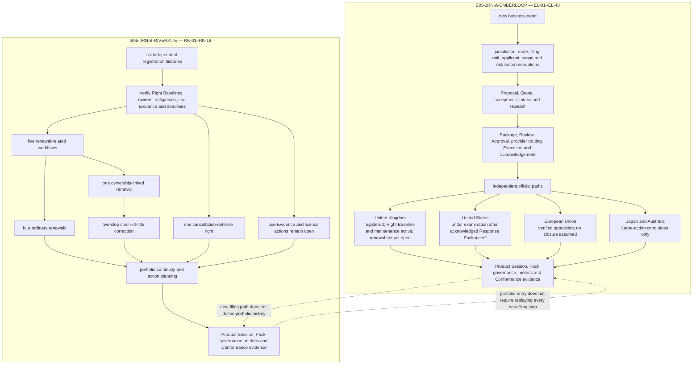

# B05-FIG-12 — EMBERLOOP and RIVERKITE Reference Journeys

## Control

- **Status:** Controlled Figure Source v1.0 — PF-07
- **Disposition:** retained
- **Format:** Mermaid flowchart
- **Primary sources:** B05-SPEC-0002 v0.3 and Appendix D
- **Intended placement:** Appendix D

## Caption

**Figure 12. The two controlled reference journeys enter MarkReg from different lifecycle positions.** EMBERLOOP begins with a new international filing need; RIVERKITE begins with six existing registrations and portfolio obligations. Their jurisdictions and rights remain independent throughout the Product journey.

## Controlled Source

## Accessibility Description

The figure contains two vertical journey panels. EMBERLOOP starts with a new business need, moves through recommendation, commercial confirmation, Intake, filing preparation, governed action and acknowledgement, then separates into four jurisdiction outcomes: the United Kingdom is registered with maintenance active and renewal not yet open; the United States remains under examination after an acknowledged second response package; the European Union remains in verified opposition; Japan and Australia are future-action candidates only. RIVERKITE starts with six independent registrations, verifies baselines and obligations, then separates into four ordinary renewals, one ownership-linked renewal, one cancellation-defense right, a two-step chain-of-title correction and open use-evidence and licence actions. Both journeys later support Product Session, Pack governance, metrics and Conformance evidence.

## Grayscale and Legibility Notes

- Each journey is enclosed in a separately titled subgraph.
- Jurisdiction and right outcomes are written in full and do not depend on color.
- Render as a two-column landscape figure or as two consecutive portrait panels.
- No arrow should visually merge the independent UK, US, EU, Japan/Australia or six RIVERKITE right states.

## Simplifications and Boundary

The figure summarizes the controlled examples and omits many intermediate EL and RK steps. It does not represent real clients, current jurisdiction law or guaranteed outcomes. It does not invent filing, registration, settlement, renewal, recordal, cancellation or closure results beyond B05-SPEC-0002 v0.3.