# B06-APP-0004 — Figure Register and Semantic Diagrams

## Status and authority

```text
Record: B06-APP-0004
Type: Reader-facing figure register
Status: Candidate — accepted on RC Hardening B owner merge
Figure format: GitHub-renderable Mermaid
Semantic review: COMPLETE FOR HARDENING B
Cross-format rendered validation: DEFERRED TO HARDENING C
Creates implementation architecture: NO
```

These figures explain accepted Book 06 relationships. They do not select database, API, model, provider, deployment or infrastructure design.

## Figure register

| Figure | Title | Primary reading | Semantic status |
| --- | --- | --- | --- |
| B06-FIG-01 | Lite position in MarkOrbit | CH03–CH06, CH26–CH29 | reviewed |
| B06-FIG-02 | Four connected Product loops | CH05, CH33 | reviewed |
| B06-FIG-03 | Today daily operating sequence | CH07–CH11 | reviewed |
| B06-FIG-04 | Observation to Candidate and Disposition | CH09–CH10 | reviewed |
| B06-FIG-05 | Growth sources and reference journeys | CH12–CH16 | reviewed |
| B06-FIG-06 | Professional work-product lifecycle | CH17–CH21 | reviewed |
| B06-FIG-07 | Case, memory, Asset and Knowledge paths | CH22–CH25 | reviewed |
| B06-FIG-08 | Common Handoff and Return model | CH11, CH26–CH29 | reviewed |
| B06-FIG-09 | Local/Private Hybrid Minimization | CH08, CH29 | reviewed |
| B06-FIG-10 | MVP 0 Customer Opportunity-to-Governed-Service Loop | CH30–CH31 | reviewed |
| B06-FIG-11 | Product identity to fulfillment evidence | CH32 | reviewed |
| B06-FIG-12 | Change classification ladder | CH33 | reviewed |

---

## <a id="b06-figure-01"></a>B06-FIG-01 — Lite position in MarkOrbit

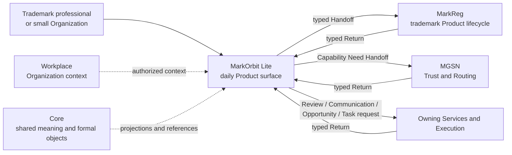

**Semantic locks**

```text
Lite owns Product experience, candidates, preparation and continuity.
Owning Services own formal business truth.
Display or integration does not transfer ownership.
```

---

## <a id="b06-figure-02"></a>B06-FIG-02 — Four connected Product loops

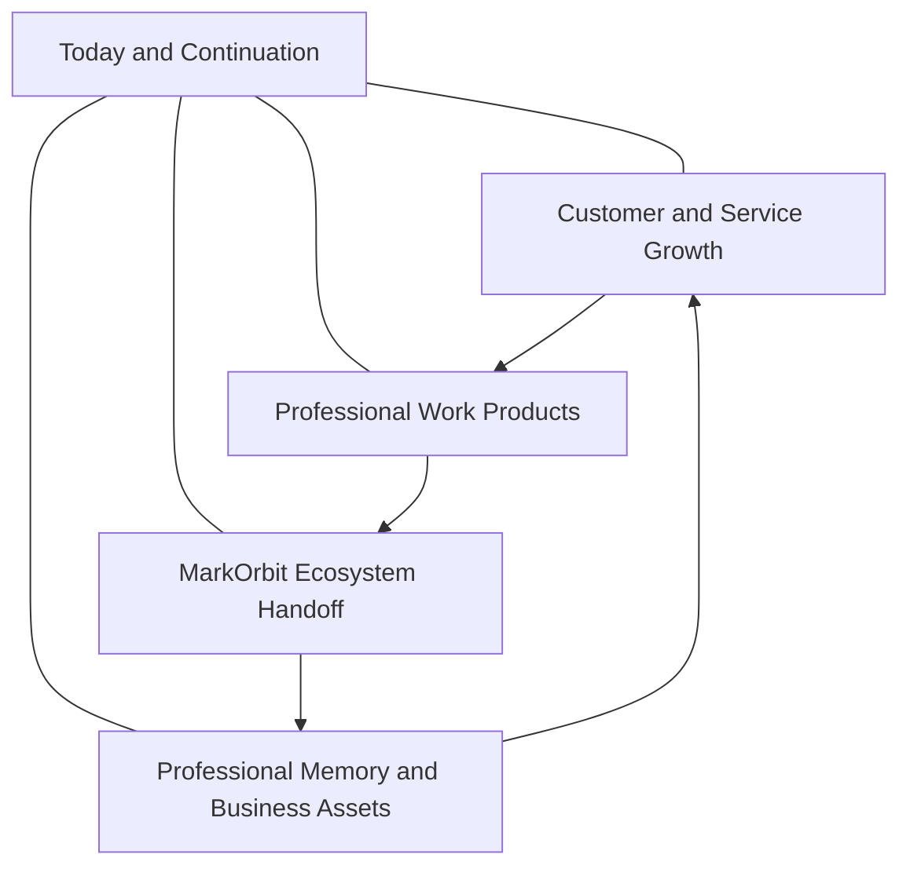

**Semantic locks**

- the loops are connected, not a mandatory linear workflow;
- Today is a daily cockpit, not the Product identity;
- no loop absorbs formal lifecycle ownership.

---

## <a id="b06-figure-03"></a>B06-FIG-03 — Today daily operating sequence

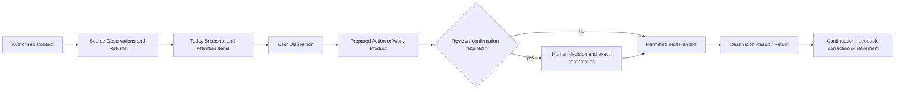

**Semantic locks**

```text
Today item ≠ active Task
Recommendation ≠ Decision
Prepared Action ≠ execution
Return ≠ Lite-owned formal truth
```

---

## <a id="b06-figure-04"></a>B06-FIG-04 — Observation to Candidate and Disposition

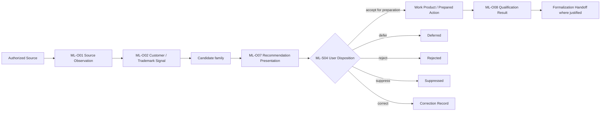

**Semantic locks**

- extraction does not create canonical truth;
- Candidate acceptance does not create formal Opportunity;
- qualification remains Product-local until destination acceptance.

---

## <a id="b06-figure-05"></a>B06-FIG-05 — Growth sources and reference journeys

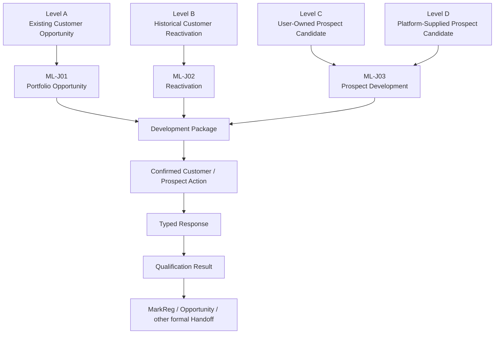

**Semantic locks**

```text
Existing customer value is preferred before cold prospect volume.
Prospect Candidate ≠ purchase intent.
Relationship history ≠ current channel permission.
```

---

## <a id="b06-figure-06"></a>B06-FIG-06 — Professional work-product lifecycle

```mermaid
flowchart LR
    P[Purpose and Audience] --> AC[Authorized Context and Sources]
    AC --> SC[ML-W01 Structured Content]
    SC --> AD[ML-W02 Artifact Draft]
    AD --> AV[ML-W03 Immutable Version]
    AV --> RP[ML-W04 Review Package]
    RP --> RR{Review Result}
    RR -->|revision required| AD
    RR -->|approved within scope| RQ[ML-W07 Render Request]
    RQ --> RT[ML-W08 Render Result]
    RT --> RD[ML-W10 Readiness Result]
    RD --> PK[ML-W09 Delivery / Publish Package]
    PK --> CF[Exact-purpose confirmation]
    CF --> OP[Manual or governed operation]
    OP --> OUT[Outcome Observation]
    OUT --> FB[Feedback / Correction / Reuse / Retirement]
```

**Semantic locks**

```text
Content ≠ Artifact
Artifact ≠ Document / Evidence / file
Render complete ≠ approved
Package ready ≠ externally completed
```

---

## <a id="b06-figure-07"></a>B06-FIG-07 — Case, memory, Asset and Knowledge paths

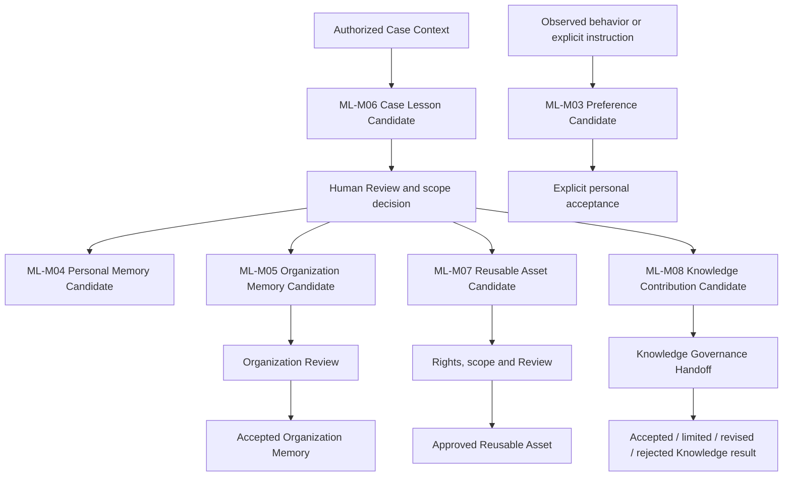

**Semantic locks**

```text
case experience ≠ universal rule
personal memory ≠ Organization memory
Reusable Asset ≠ canonical Knowledge
anonymized ≠ authorized for publication
```

---

## <a id="b06-figure-08"></a>B06-FIG-08 — Common Handoff and Return model

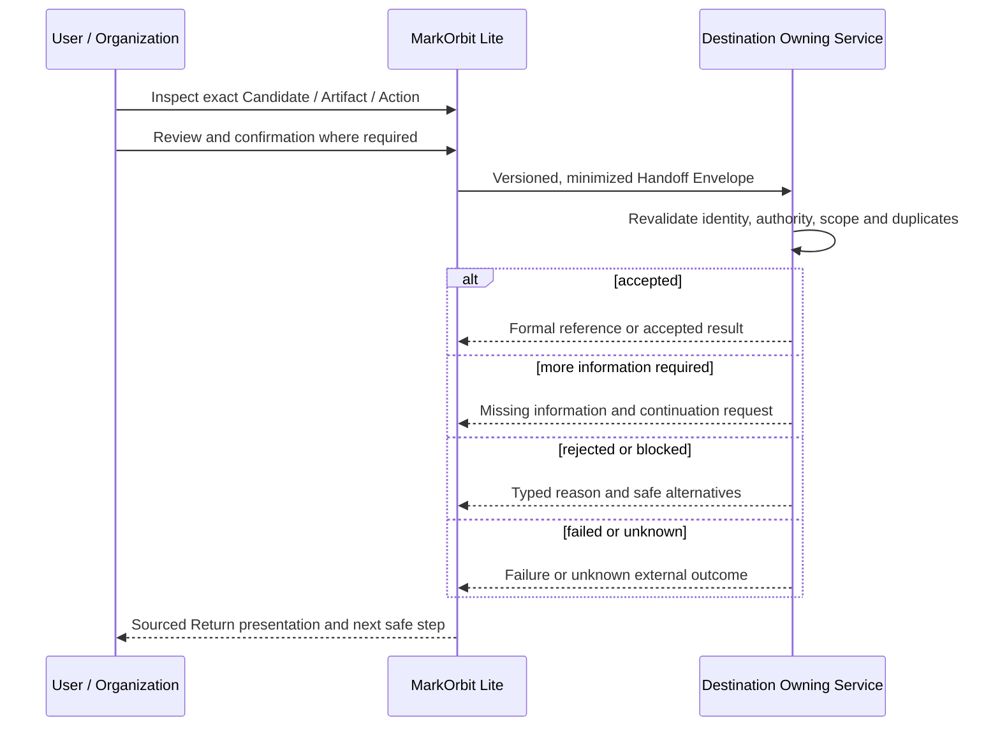

**Semantic locks**

```text
Handoff ≠ destination acceptance
accepted request ≠ completed action
unknown outcome ≠ safe to retry
```

---

## <a id="b06-figure-09"></a>B06-FIG-09 — Local/Private Hybrid Minimization

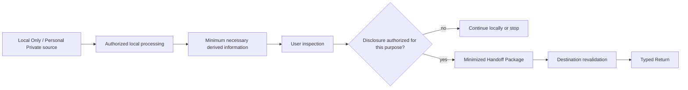

**Semantic locks**

```text
readable locally ≠ synchronized
local processing ≠ remote AI permission
derived information retains restrictions
one authorized disclosure ≠ general sharing authority
```

---

## <a id="b06-figure-10"></a>B06-FIG-10 — MVP 0 Customer Opportunity-to-Governed-Service Loop

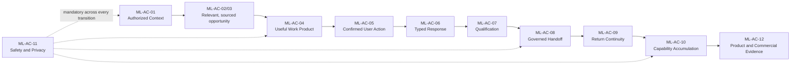

**Semantic locks**

- `ML-AC-01–AC-11` are mandatory;
- `ML-AC-12` collects experiment-specific evidence;
- content volume or prospect volume alone cannot pass MVP 0.

---

## <a id="b06-figure-11"></a>B06-FIG-11 — Product identity to fulfillment evidence

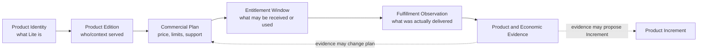

**Semantic locks**

```text
Product identity ≠ Commercial Plan
payment ≠ authority
file generated ≠ entitlement fulfilled
commercial evidence may change plan without silently changing constitution
```

---

## <a id="b06-figure-12"></a>B06-FIG-12 — Change classification ladder

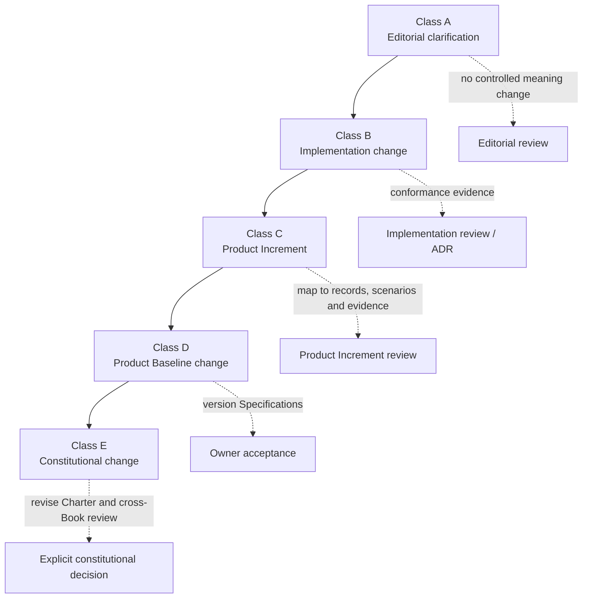

**Semantic locks**

- a change is classified by meaning and responsibility, not development effort;
- Class D and E cannot enter through an ordinary implementation PR;
- price, provider and UI changes do not automatically change Product identity.

## Figure review rule

Each figure was checked against the Product Charter, `B06-SPEC-0001–0004` and the cited chapters for:

- ownership direction;
- Candidate/formal-state separation;
- Human decision visibility;
- typed Handoff and Return;
- failure and unknown states;
- commercial/Product separation;
- local/private boundaries;
- absence of implementation commitments.

Hardening C must validate Mermaid rendering, PDF/equivalent rendering, legibility, page breaks, links and font substitution before Release Candidate review.
